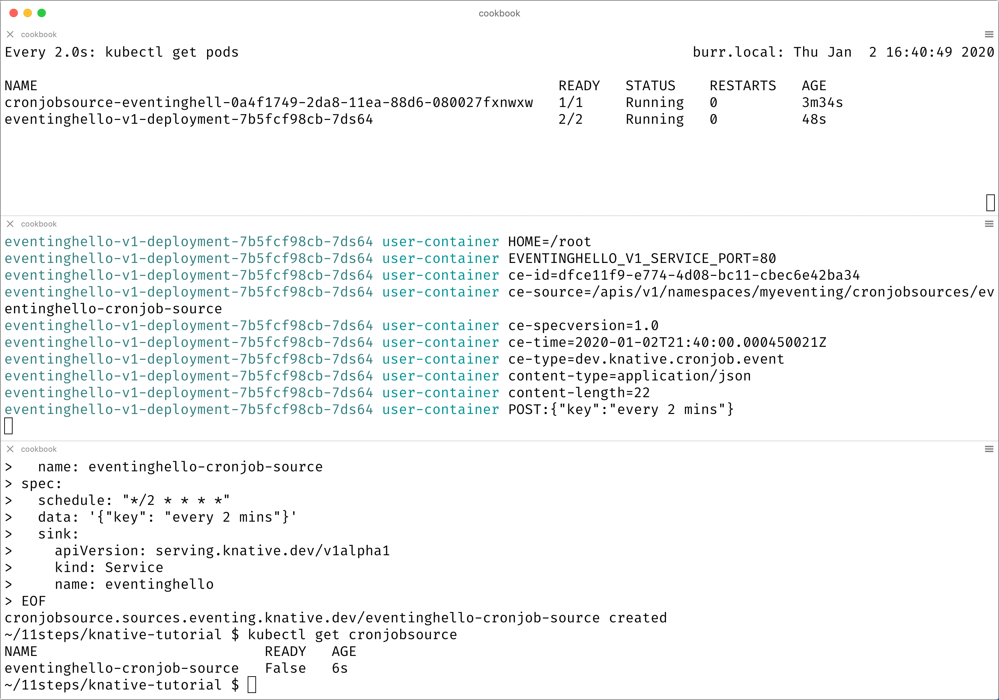
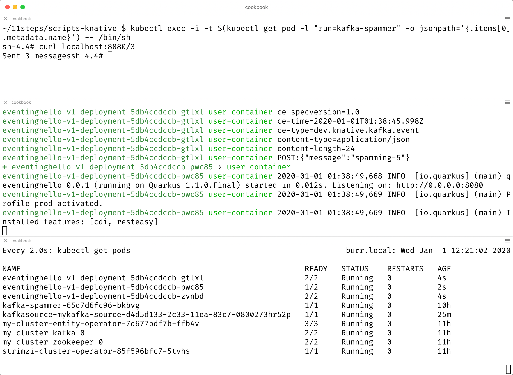

= Knative Eventing

From basics to Kafka using the direct https://docs.google.com/presentation/d/1kQn4HBUmSDH_EcRNPB8hAsoJetrVGM9hkDI0rriFGKA/edit#slide=id.g6234e6907d_0_40[Source to (Sink) Service] approach.  This means the return value of the Service (Sink) is ignored.

== Prerequistes:

Create an env variable called BOOK_HOME to point to where you git cloned 

git clone -b knative-cookbook https://github.com/redhat-developer-demos/knative-tutorial

export BOOK_HOME=~/11steps/knative-tutorial/

* Working Minikube
----
./1_startMinikube.sh
----

* Istio Installed
----
./2_install_istio.sh
----

* Knative CRDS Installed

----
./3_install_knative_crds.sh
----

* Knative Serving Installed

----
./4_install_knative_serving.sh
----

* Knative Eventing Installed

----
./5_install_knative_eventing.sh
----

=== Check Knative CRDS
----
kubectl get crds | grep knative
apiserversources.sources.eventing.knative.dev        2019-12-28T22:48:39Z
brokers.eventing.knative.dev                         2019-12-28T22:48:39Z
certificates.networking.internal.knative.dev         2019-12-28T22:48:38Z
channels.messaging.knative.dev                       2019-12-28T22:48:39Z
configurations.serving.knative.dev                   2019-12-28T22:48:38Z
containersources.sources.eventing.knative.dev        2019-12-28T22:48:39Z
cronjobsources.sources.eventing.knative.dev          2019-12-28T22:48:39Z
eventtypes.eventing.knative.dev                      2019-12-28T22:48:39Z
images.caching.internal.knative.dev                  2019-12-28T22:48:38Z
ingresses.networking.internal.knative.dev            2019-12-28T22:48:38Z
inmemorychannels.messaging.knative.dev               2019-12-28T22:48:39Z
metrics.autoscaling.internal.knative.dev             2019-12-28T22:48:38Z
parallels.flows.knative.dev                          2019-12-28T22:48:39Z
parallels.messaging.knative.dev                      2019-12-28T22:48:39Z
podautoscalers.autoscaling.internal.knative.dev      2019-12-28T22:48:38Z
revisions.serving.knative.dev                        2019-12-28T22:48:38Z
routes.serving.knative.dev                           2019-12-28T22:48:38Z
sequences.flows.knative.dev                          2019-12-28T22:48:39Z
sequences.messaging.knative.dev                      2019-12-28T22:48:39Z
serverlessservices.networking.internal.knative.dev   2019-12-28T22:48:38Z
services.serving.knative.dev                         2019-12-28T22:48:38Z
sinkbindings.sources.eventing.knative.dev            2019-12-28T22:48:39Z
subscriptions.messaging.knative.dev                  2019-12-28T22:48:39Z
triggers.eventing.knative.dev                        2019-12-28T22:48:39Z
----

=== Check Knative Serving Installation
----
kubectl get pods -n knative-serving
NAME                                READY   STATUS    RESTARTS   AGE
activator-764c84b867-hmdsq          1/1     Running   0          6h34m
autoscaler-6d78bfc6f-8v9d8          1/1     Running   0          6h34m
autoscaler-hpa-595fcbc958-r77tm     1/1     Running   0          6h34m
controller-7f9d9ffff7-9gws9         1/1     Running   0          6h34m
networking-istio-65cb5dc74d-dmfsh   1/1     Running   0          6h34m
webhook-8fb4f7f8-fzfvx              1/1     Running   0          6h34m
----

=== Check Knative Eventing Installation
----
kubectl get pods -n knative-eventing
NAME                                   READY   STATUS    RESTARTS   AGE
eventing-controller-666b79d867-kq8cc   1/1     Running   0          6h34m
eventing-webhook-5867c98d9b-hzctw      1/1     Running   0          6h34m
imc-controller-7c4f9945d7-s59xd        1/1     Running   0          6h34m
imc-dispatcher-7b55b86649-nsjm2        1/1     Running   0          6h34m
sources-controller-694f8df9c4-pss2w    1/1     Running   0          6h34m
----

=== Check CRDs & api-resources
----
kubectl get crds | grep knative
apiserversources.sources.eventing.knative.dev        2019-12-31T14:05:46Z
brokers.eventing.knative.dev                         2019-12-31T14:05:46Z
certificates.networking.internal.knative.dev         2019-12-31T14:05:45Z
channels.messaging.knative.dev                       2019-12-31T14:05:46Z
configurations.serving.knative.dev                   2019-12-31T14:05:45Z
containersources.sources.eventing.knative.dev        2019-12-31T14:05:46Z
cronjobsources.sources.eventing.knative.dev          2019-12-31T14:05:46Z
eventtypes.eventing.knative.dev                      2019-12-31T14:05:47Z
images.caching.internal.knative.dev                  2019-12-31T14:05:45Z
ingresses.networking.internal.knative.dev            2019-12-31T14:05:45Z
inmemorychannels.messaging.knative.dev               2019-12-31T14:05:47Z
metrics.autoscaling.internal.knative.dev             2019-12-31T14:05:45Z
parallels.flows.knative.dev                          2019-12-31T14:05:47Z
parallels.messaging.knative.dev                      2019-12-31T14:05:47Z
podautoscalers.autoscaling.internal.knative.dev      2019-12-31T14:05:45Z
revisions.serving.knative.dev                        2019-12-31T14:05:45Z
routes.serving.knative.dev                           2019-12-31T14:05:45Z
sequences.flows.knative.dev                          2019-12-31T14:05:47Z
sequences.messaging.knative.dev                      2019-12-31T14:05:47Z
serverlessservices.networking.internal.knative.dev   2019-12-31T14:05:45Z
services.serving.knative.dev                         2019-12-31T14:05:45Z
sinkbindings.sources.eventing.knative.dev            2019-12-31T14:05:47Z
subscriptions.messaging.knative.dev                  2019-12-31T14:05:47Z
triggers.eventing.knative.dev                        2019-12-31T14:05:47Z
----

----
kubectl api-resources --api-group='serving.knative.dev'
NAME             SHORTNAMES      APIGROUP              NAMESPACED   KIND
configurations   config,cfg      serving.knative.dev   true         Configuration
revisions        rev             serving.knative.dev   true         Revision
routes           rt              serving.knative.dev   true         Route
services         kservice,ksvc   serving.knative.dev   true         Service
----

----
kubectl api-resources --api-group='messaging.knative.dev'
NAME               SHORTNAMES   APIGROUP                NAMESPACED   KIND
channels           ch           messaging.knative.dev   true         Channel
inmemorychannels   imc          messaging.knative.dev   true         InMemoryChannel
parallels                       messaging.knative.dev   true         Parallel
sequences                       messaging.knative.dev   true         Sequence
subscriptions      sub          messaging.knative.dev   true         Subscription
----

----
kubectl api-resources --api-group='eventing.knative.dev'
NAME         SHORTNAMES   APIGROUP               NAMESPACED   KIND
brokers                   eventing.knative.dev   true         Broker
eventtypes                eventing.knative.dev   true         EventType
triggers                  eventing.knative.dev   true         Trigger
----

----
kubectl api-resources --api-group='sources.eventing.knative.dev'
NAME               SHORTNAMES   APIGROUP                       NAMESPACED   KIND
apiserversources                sources.eventing.knative.dev   true         ApiServerSource
containersources                sources.eventing.knative.dev   true         ContainerSource
cronjobsources                  sources.eventing.knative.dev   true         CronJobSource
sinkbindings                    sources.eventing.knative.dev   true         SinkBinding
----

[[ch05-knative-eventing]]
== Knative Eventing Recipes
:knative-eventing-version: v0.11
:book-namespace: knativetutorial

[[ch05-knative-eventing-intro]]
== Understanding Knative Eventing
As previously described in Chapter 1, Knative has two major sub-projects: Serving and Eventing. With Serving you have dynamic auto-scaling, including scaling down to zero pods, based on HTTP traffic load.  With Eventing, you now have that same auto-scaling capability but bridged into other protocols or from other sources beyond HTTP.  For example, a barrage of messages flowing through an Apache Kafka topic can cause auto-scaling of your Kubernetes-based service to handle those messages. Or perhaps a scheduled event via Cron, can cause your service to awake from its slumber and perform its duties.

=== Sources, Sinks, Services
There are 3 "styles" of Knative Eventing, rising in complexity and in capability:

* Source to Service
  ** Single sink - event receiving service
  ** Simplest getting started experience
  ** No queuing, no backpressure, no filtering
  ** No replies

  Source -> Sink -> Knative Service1

* Channels and Subscriptions
  ** Multiple sinks, mutiple event receiving services
  ** Various channel backends: In-memory, Kafka, GCP PubSub
  ** Supports replies
  ** No filtering

  Source -> Sink -> Channel -> Subscriber -> Knative Service1, Service2

* Brokers and Triggers
  ** Multiple sinks, mutiple event receiving services
  ** Allows for filtering

  Source -> Broker -> Trigger -> Knative Service1, Service2

Knative Eventing Sources are software components that emit events.  Their job is to connect to, drain, capture and potentially buffer events, often from external systems and then relay those events to Sinks. 

The out-of-the-box Knative Eventing Sources can be inquired by "kubectl api-resources" command.
----
kubectl api-resources --api-group='sources.eventing.knative.dev'

NAME              APIGROUP                      NAMESPACED   KIND
apiserversources  sources.eventing.knative.dev  true         ApiServerSource
containersources  sources.eventing.knative.dev  true         ContainerSource
cronjobsources    sources.eventing.knative.dev  true         CronJobSource
----

The ApiServerSource allows you to listen in on Kubernetes API events, like those events displayed by "kubectl get events". 

The Container Source allows you to create your own container that emits events which can be targeted at Sinks, your Service.

The Cron Job Source allows you to specify a Cron timer, a recurring task, that will emit an event to your Sink.

There are many other Source types and you can review the current list of Sources at https://knative.dev/v0.11-docs/eventing/sources/index.html

Knative Eventing Sinks are software components that are the event receiver, the consumer of the event. Sinks can be invoked directly in a point-to-point fashion. These Sinks can target one of your Services - your code that will receive a HTTP POST with a CloudEvent payload. However, the Sink is also very flexible, it might point to a Channel or a Broker - allowing for a publish-subscribe messaging pattern - allowing for many potential receivers.

[[ch05-source-to-service]]
=== Source to Service 

Knative Eventing can target or sink to a Kubernetes Service, in our case, we will use a Knative Serving Service as the target of the event - the Sink.

The primary focus of the code is to receive the POST and then to log out the CloudEvent relevant information therefore your Java code may look like the following:

[source,java]
----
  @PostMapping("/")
  public ResponseEntity<String> myPost (
    HttpEntity<String> http) {
  
    System.out.println("ce-id=" + http.getHeaders().get("ce-id"));
    System.out.println("ce-source=" + http.getHeaders().get("ce-source"));
    System.out.println("ce-specversion=" + http.getHeaders().get("ce-specversion"));
    System.out.println("ce-time=" + http.getHeaders().get("ce-time"));
    System.out.println("ce-type=" + http.getHeaders().get("ce-type"));
    System.out.println("content-type=" + http.getHeaders().getContentType());
    System.out.println("content-length=" + http.getHeaders().getContentLength());

    System.out.println("POST:" + http.getBody());
  } 
----

Details on the CloudEvent to HTTP mapping information can be found here
https://github.com/cloudevents/spec/blob/master/http-protocol-binding.md#3-http-message-mapping

First deploy the Knative Serving Service into namespace myeventing.

[source,bash]
----
kubectl create namespace myeventing
kubectl config set-context --current --namespace=myeventing
----

Next deploy the event consumer/receiver, the sink service

[source,yaml]
----
cat <<EOF | kubectl apply -f -
apiVersion: serving.knative.dev/v1alpha1
kind: Service
metadata:
  name: eventinghello
spec:
  template:
    metadata:
      name: eventinghello-v1
      annotations:
        # disable istio-proxy injection
        sidecar.istio.io/inject: "false"
        autoscaling.knative.dev/target: "1"
    spec:
      containers:
      - image: quay.io/burrsutter/eventinghello:0.0.1
EOF
----

Verify that eventinghello deployed successfully where Ready is True

[source,bash]
----
kubectl get ksvc
NAME            URL                                           LATESTCREATED      LATESTREADY        READY   REASON
eventinghello   http://eventinghello.myeventing.example.com   eventinghello-v1   eventinghello-v1   True
----

The default behavior of Knative Serving is that the very first deployment of a Knative Serving Service will automatically scale up to 1 and after about 90 seconds it will auto-scale down to zero.

You can watch the pod lifecycle with the following command.

[source,bash]
----
watch kubectl get pods
----

And you can monitor the logs of the eventinghello pod with

[source,bash]
----
stern eventing -c user-container
----

Let eventinghello scale to zero pods before moving on.

Deploy a CronJobSource

[source,yaml]
----
cat <<EOF | kubectl apply -f -
apiVersion: sources.eventing.knative.dev/v1alpha1
kind: CronJobSource
metadata:
  name: eventinghello-cronjob-source
spec:
  schedule: "*/2 * * * *"
  data: '{"key": "every 2 mins"}'
  sink:
    apiVersion: serving.knative.dev/v1alpha1
    kind: Service
    name: eventinghello
EOF
----

[source,bash]
----
kubectl get cronjobsource
NAME                           READY   AGE
eventinghello-cronjob-source   True    10s
----

This produces a pod with a prefix of "cronjobsource-eventinghell"

[source,bash]
----
watch kubectl get pods
NAME                                            READY   STATUS    RESTARTS   AGE
cronjobsource-eventinghell-54b9ef12-2c2f-11ea   1/1     Running   0          14s
----

After approximately 2 minutes, it will cause the eventinghello pod to scale up. 

[source,bash]
----
watch kubectl get pods
NAME                                           READY   STATUS    RESTARTS   AGE
cronjobsource-eventinghell-54b9ef12-2c2f-11ea  1/1     Running   0          97s
eventinghello-v1-deployment-7cfcb664ff-r694p   2/2     Running   0          10s
----

And after approximately 60 seconds, eventinghello will auto-scale down to zero pods.

[source,bash]
----
watch kubectl get pods
NAME                                           READY   STATUS        RESTARTS   AGE
cronjobsource-eventinghell-54b9ef12-2c2f-11ea  1/1     Running       0          2m28s
eventinghello-v1-deployment-7cfcb664ff-r694p   2/2     Terminating   0          65s
----

You can follow logs to see the CloudEvent details by using stern.

[source,bash]
----
stern eventinghello -c user-container
# the following sample output has been truncated for readability
ce-id=a1e0cbea-8f66-4fa6-8f3c-e5590c4ee147
ce-source=/apis/v1/namespaces/myeventing/cronjobsources/eventinghello-cronjob-source
ce-specversion=1.0
ce-time=2020-01-01T00:44:00.000889221Z
ce-type=dev.knative.cronjob.event
content-type=application/json
content-length=22
POST:{"key":"every 2 mins"}
----

Clean up your experiment by delete the whole namespace.

[source,bash]
----
kubectl delete namespace myeventing
----

[[ch05-kafka-knative-eventing]]
== Kafka + Knative Eventing

In this section, we will deploy Kafka (via Strimzi) and the Knative Kafka Source.  Then have the messages flowing through the Kafka topic as the event that causes the scale-up of the sink Knative Serving Service called eventhinghello.

Deploy Kafka for Kubernetes (Strimzi) inside Minikube

https://strimzi.io/quickstarts/minikube/

Create a namespace called Kafka 

[source,bash]
----
kubectl create namespace kafka
kubectl config set-context --current --namespace=kafka
----

Install the Strimzi Operator.  

[source,bash]
----
curl -L https://github.com/strimzi/strimzi-kafka-operator/releases/download/0.15.0/strimzi-cluster-operator-0.15.0.yaml \
  | sed 's/namespace: .*/namespace: kafka/' \
  | kubectl apply -f - -n kafka 
----

The result will be the single strimzi-cluster-operator.

[source,bash]
----
kubectl get pods
strimzi-cluster-operator-85f596bfc7-7dgds     1/1     Running   0          1m2s
----

As well as several CRDs, Custom Resource Definitions, that allow you to deploy Kafka clusters into a Kubernetes cluster.

[source,bash]
----
kubectl get crds | grep kafka
kafkabridges.kafka.strimzi.io                        2019-12-28T14:53:14Z
kafkaconnects.kafka.strimzi.io                       2019-12-28T14:53:14Z
kafkaconnects2is.kafka.strimzi.io                    2019-12-28T14:53:14Z
kafkamirrormakers.kafka.strimzi.io                   2019-12-28T14:53:14Z
kafkas.kafka.strimzi.io                              2019-12-28T14:53:14Z
kafkatopics.kafka.strimzi.io                         2019-12-28T14:53:14Z
kafkausers.kafka.strimzi.io                          2019-12-28T14:53:14Z
----

Deploy a Kafka Cluster inside Minikube 

[source,yaml]
----
cat <<EOF | kubectl apply -f -
apiVersion: kafka.strimzi.io/v1beta1
kind: Kafka
metadata:
  name: my-cluster
spec:
  kafka:
    version: 2.3.1
    replicas: 1
    listeners:
      plain: {}
      tls: {}
    config:
      offsets.topic.replication.factor: 1
      transaction.state.log.replication.factor: 1
      transaction.state.log.min.isr: 1
      log.message.format.version: "2.3"
    storage:
      type: jbod
      volumes:
      - id: 0
        type: persistent-claim
        size: 100Gi
        deleteClaim: false
  zookeeper:
    replicas: 1
    storage:
      type: persistent-claim
      size: 100Gi
      deleteClaim: false
  entityOperator:
    topicOperator: {}
    userOperator: {}
EOF    
----

The result will be a single Zookeeper, single Kafka broker and the entity-operator

[source,bash]
----
kubectl get pods 
NAME                                          READY   STATUS    RESTARTS   AGE
my-cluster-entity-operator-7d677bdf7b-jpws7   3/3     Running   0          85s
my-cluster-kafka-0                            2/2     Running   0          110s
my-cluster-zookeeper-0                        2/2     Running   0          2m22s
strimzi-cluster-operator-85f596bfc7-7dgds     1/1     Running   0          4m22s
----

Create Kafka Topic my-topic

[source,yaml]
----
cat <<EOF | kubectl apply -f -
apiVersion: kafka.strimzi.io/v1alpha1
kind: KafkaTopic
metadata:
  name: my-topic
  labels:
    strimzi.io/cluster: my-cluster
spec:
  partitions: 10
  replicas: 1
EOF
----

Note: The partitions 10 allows for more concurrent scale-out of sink pods

Check that the topic was created.

[source,bash]
----
kubectl get kafkatopics
NAME       PARTITIONS   REPLICATION FACTOR
my-topic   10           1
----

Create some test messages for the Kafka topic.  The sample repository includes a script for producing Kafka messages.  Execute the script and type in "one", "two", etc.

Terminal 1 - Producer

[source,bash]
----
$BOOK_HOME/bin/kafka-producer.sh
>one
>two
>three
----

Terminal 2 - Consumer

[source,bash]
----
$BOOK_HOME/bin/kafka-consumer.sh
one
two
three
----

Use Ctrl-C to stop producer & consumer pods.

Create the Knative Kafka Source

[source,bash]
----
kubectl apply -f https://github.com/knative/eventing-contrib/releases/download/v0.11.0/kafka-source.yaml
----

This step creates Knative Kafka Source in the knative-sources namespace as well as a CRD, ServiceAccount, ClusterRole, etc 

[source,bash]
----
kubectl get pods -n knative-sources
NAME                         READY   STATUS    RESTARTS   AGE
kafka-controller-manager-0   1/1     Running   0          1m17s
----

Create the Knative Kafka Channel

[source,bash]
----
curl -L "https://github.com/knative/eventing-contrib/releases/download/v0.11.0/kafka-channel.yaml" \
 | sed 's/REPLACE_WITH_CLUSTER_URL/my-cluster-kafka-bootstrap.kafka:9092/' \
 | kubectl apply --filename -  
----

Note: "my-cluster-kafka-bootstrap.kafka:9092" comes from "kubectl get services -n kafka"

Look for 3 new pods in namespace knative-eventing with the prefix "kafka"

[source,bash]
----
kubectl get pods -n knative-eventing
NAME                                   READY   STATUS    RESTARTS   AGE
eventing-controller-666b79d867-kq8cc   1/1     Running   0          64m
eventing-webhook-5867c98d9b-hzctw      1/1     Running   0          64m
imc-controller-7c4f9945d7-s59xd        1/1     Running   0          64m
imc-dispatcher-7b55b86649-nsjm2        1/1     Running   0          64m
kafka-ch-controller-7c596b6b55-fzxcx   1/1     Running   0          33s
kafka-ch-dispatcher-577958f994-4f2qs   1/1     Running   0          33s
kafka-webhook-74bbd99f5c-c84ls         1/1     Running   0          33s
sources-controller-694f8df9c4-pss2w    1/1     Running   0          64m  
----

and some new CRDs and api-resources

[source,bash]
----
kubectl get crds | grep kafkasources
kafkasources.sources.eventing.knative.dev            2019-12-28T14:53:14Z

kubectl get crds | grep kafkachannels
kafkachannels.messaging.knative.dev                  2019-12-28T15:00:22Z

kubectl api-resources --api-group='sources.eventing.knative.dev'
NAME               SHORTNAMES   APIGROUP                       NAMESPACED   KIND
apiserversources                sources.eventing.knative.dev   true         ApiServerSource
containersources                sources.eventing.knative.dev   true         ContainerSource
cronjobsources                  sources.eventing.knative.dev   true         CronJobSource
kafkasources                    sources.eventing.knative.dev   true         KafkaSource
sinkbindings                    sources.eventing.knative.dev   true         SinkBinding
----

Deploy the Knative Serving Service - the event consumer, the sink

[source,yaml]
----
cat <<EOF | kubectl apply -f -
apiVersion: serving.knative.dev/v1alpha1
kind: Service
metadata:
  name: eventinghello
spec:
  template:
    metadata:
      name: eventinghello-v1
      annotations:
        # disable istio-proxy injection
        sidecar.istio.io/inject: "false"
        autoscaling.knative.dev/target: "1"
    spec:
      containers:
      - image: quay.io/burrsutter/eventinghello:0.0.1
EOF
----

And verify that it was deployed.

[source,bash]
----
kubectl get ksvc
NAME            URL                                      LATESTCREATED      LATESTREADY        READY   REASON
eventinghello   http://eventinghello.kafka.example.com   eventinghello-v1   eventinghello-v1   True
----

Make sure to follow the logs

[source,bash]
----
stern eventinghello -c user-container
----

The initial deployment of "eventinghello" will cause it to scale up to 1 pod.  It will be around until it hits its scale-down time limit.  Allow it to scale down before continuing.

Create KafkaSource for my-topic by connecting your Kafka my-topic to eventinghello via a KafkaSource

[source,yaml]
----
cat <<EOF | kubectl apply -f -
apiVersion: sources.eventing.knative.dev/v1alpha1
kind: KafkaSource
metadata:
  name: mykafka-source
spec:
  consumerGroup: knative-group
  bootstrapServers: my-cluster-kafka-bootstrap:9092 
  topics: my-topic
  sink:
    apiVersion: serving.knative.dev/v1alpha1
    kind: Service
    name: eventinghello
EOF
----

This will result in a new pod prefixed with "mykafka-source". 

[source,bash]
----
kubectl get pods
NAME                                           READY   STATUS    RESTARTS   AGE
my-cluster-entity-operator-7d677bdf7b-jpws7    3/3     Running   0          22m
my-cluster-kafka-0                             2/2     Running   0          22m
my-cluster-zookeeper-0                         2/2     Running   0          23m
mykafka-source-vxs2k-56548756cc-j7m7v          1/1     Running   0          11s
strimzi-cluster-operator-85f596bfc7-7dgds      1/1     Running   0          25m
----

Note: since we had some test messages of "one", "two" and "three" from earlier you might see the eventinghello service awaken to process those messages.  Since the "one", "two", and "three" were not entered as JSON, your http body will not be interpreted correctly.  Knative Eventing endpoints require JSON input.

Wait for eventinghello to scale down to zero pods before moving on then publish some Kafka messages into my-topic.

Note: Knative Eventing messages needs to be JSON formatted

[source,bash]
----
$BOOK_HOME/bin/kafka-producer.sh
----

And provide the following JSON-formatted messages

[source,json]
----
{"hello":"world"}

{"hola":"mundo"}

{"bonjour":"le monde"}

{"hey": "duniya"}
----

Make sure to monitor the logs of the eventinghello pod

[source,bash]
----
stern eventinghello -c user-container
----

Output shortened for brevity and formatting reasons

[source,bash]
----
ce-id=partition:1/offset:1
ce-source=/apis/v1/namespaces/kafka/kafkasources/mykafka-source#my-topic
ce-specversion=1.0
ce-time=2020-01-01T01:16:12.886Z
ce-type=dev.knative.kafka.event
content-type=application/json
content-length=17
POST:{"hey": "duniya"}
----

Ctrl-C to terminate producer.

The Knative Serving Sink Service was defined with the following annotation that limits concurrency to approximately 1 pod per event (Kafka message)

----
autoscaling.knative.dev/target: "1"
----

This means a concurrency factor of one, if you are able to push in a number of Kafka message rapidly, you will see more than one eventinghello pod scaled up to handle the load.

I a simple Java based application has been created that allows you to push in messages rapidly.  You just need to hit the right endpoint on the Kafka Spammer application to push in 3 messages.

Lauch the kafka-spammer pod.

[source,bash]
----
kubectl -n kafka run kafka-spammer --image=quay.io/burrsutter/kafkaspammer:1.0.2 
----

Then exec into the running kafka-spammer pod.

[source,bash]
----
kubectl exec -i -t $(kubectl get pod -l "run=kafka-spammer" -o jsonpath='{.items[0].metadata.name}') -- /bin/sh
----

And use curl to send in 3 messages.

[source,bash]
----
curl localhost:8080/3
----

You should see about 3 eventinghello pods coming to life

[source,bash]
----
kubectl get pods  
NAME                                           READY   STATUS    RESTARTS   AGE
eventinghello-v1-deployment-65c9b9c7df-8rwqc   1/2     Running   0          6s
eventinghello-v1-deployment-65c9b9c7df-q7pcf   1/2     Running   0          4s
eventinghello-v1-deployment-65c9b9c7df-zht2t   1/2     Running   0          6s
kafka-spammer-77ccd4f9c6-sx5j4                 1/1     Running   0          26s
my-cluster-entity-operator-7d677bdf7b-jpws7    3/3     Running   0          27m
my-cluster-kafka-0                             2/2     Running   0          27m
my-cluster-zookeeper-0                         2/2     Running   0          28m
mykafka-source-vxs2k-56548756cc-j7m7v          1/1     Running   0          5m12s
strimzi-cluster-operator-85f596bfc7-7dgds      1/1     Running   0          30m
----

After approximately 60 seconds and no new messages showing up in my-topic, the three eventinghello pods will terminate and scale-down to zero.

Note: messages are NOT being evenly distributed across the various eventinghello pods, the first pod up starts consuming them all immediately.

To close out the spammer and remove it use "exit" 

[source,bash]
----
exit 
----

and then delete its deployment
----
kubectl delete deployment kafka-spammer
----

==== Clean up

----
kubectl delete namespace kafka
----

[[ch05-channels-subscriptions]]
=== Knative Eventing: Channels & Subscriptions

If you want more than one Sink use Channels and Subscriptions to decouple the producers & consumers of events

==== Channels

5 Step Process

1) Create a Namespace

2) Create Channel

3) Create Source to Channel

4) Create Sink Service

5) Create Subscription of Channel to Sink Service

==== 1. Create Namespace
----
kubectl create namespace myeventing
kubectl config set-context --current --namespace=myeventing
----

==== 2. Create Channel

----
cat <<EOF | kubectl apply -f -
apiVersion: messaging.knative.dev/v1alpha1
kind: Channel
metadata:
  name: eventinghello-ch
EOF
----

----
kubectl get ch
NAME               READY   REASON   URL                                                               AGE
eventinghello-ch   True             http://eventinghello-ch-kn-channel.myeventing.svc.cluster.local   36s
----

==== 3. Create Source that will send to the Channel

----
cat <<EOF | kubectl apply -f -
apiVersion: sources.eventing.knative.dev/v1alpha1
kind: CronJobSource
metadata:
  name: my-cjs
spec:
  schedule: "*/2 * * * *"
  data: '{"message": "From CronJob Source"}'
  sink:
    apiVersion: messaging.knative.dev/v1alpha1
    kind: Channel
    name: eventinghello-ch
EOF
----

----
kubectl get cronjobsource
NAME     READY   AGE
my-cjs   True    8s
----

==== 4. Create Sink Services

----
cat <<EOF | kubectl apply -f -
apiVersion: serving.knative.dev/v1alpha1
kind: Service
metadata:
  name: eventinghelloa
spec:
  template:
    metadata:
      name: eventinghelloa-1
      annotations:
        # disable istio-proxy injection
        sidecar.istio.io/inject: "false"
        autoscaling.knative.dev/target: "1"
    spec:
      containers:
      - image: quay.io/burrsutter/eventinghello:0.0.1
EOF
----

----
cat <<EOF | kubectl apply -f -
apiVersion: serving.knative.dev/v1alpha1
kind: Service
metadata:
  name: eventinghellob
spec:
  template:
    metadata:
      name: eventinghellob-1
      annotations:
        # disable istio-proxy injection
        sidecar.istio.io/inject: "false"
        autoscaling.knative.dev/target: "1"
    spec:
      containers:
      - image: quay.io/burrsutter/eventinghello:0.0.1
EOF
----

==== 5. Create Subscriptions to Channel 

----
cat <<EOF | kubectl apply -f -
apiVersion: messaging.knative.dev/v1alpha1
kind: Subscription
metadata:
  name: eventinghelloa-sub
spec:
  channel:
    apiVersion: messaging.knative.dev/v1alpha1
    kind: Channel
    name: eventinghello-ch
  subscriber:
    ref:
      apiVersion: serving.knative.dev/v1alpha1
      kind: Service
      name: eventinghelloa
EOF
----

----
cat <<EOF | kubectl apply -f -
apiVersion: messaging.knative.dev/v1alpha1
kind: Subscription
metadata:
  name: eventinghellob-sub
spec:
  channel:
    apiVersion: messaging.knative.dev/v1alpha1
    kind: Channel
    name: eventinghello-ch
  subscriber:
    ref:
      apiVersion: serving.knative.dev/v1alpha1
      kind: Service
      name: eventinghellob
EOF
----

Wait the 2 minutes for the cronjobsource and see eventinghelloa and b start to run

----
kubectl get pods
NAME                                                              READY   STATUS    RESTARTS   AGE
cronjobsource-my-cjs-93544f14-2bf9-11ea-83c7-08002737670c-6br6x   1/1     Running   0          2m15s
eventinghelloa-1-deployment-d86bf4847-hvbk6                       2/2     Running   0          5s
eventinghellob-1-deployment-5c986c7586-4clpb                      2/2     Running   0          5s
----

Wait approximately 60 seconds for eventinghelloa and b to auto-scaled down to zero

----
kubectl get pods
NAME                                                              READY   STATUS        RESTARTS   AGE
cronjobsource-my-cjs-93544f14-2bf9-11ea-83c7-08002737670c-6br6x   1/1     Running       0          7m15s
eventinghelloa-1-deployment-d86bf4847-hvbk6                       2/2     Terminating   0          65s
eventinghellob-1-deployment-5c986c7586-4clpb                      2/2     Terminating   0          65s
----

and if you wait about 60 more seconds, you will see the dev.knative.cronjob.event cause the auto-scale up of eventinghelloa and b.

==== Clean up
----
kubectl delete namespace myeventing
----

[[ch05-brokers-triggers]]
== Brokers & Triggers

1. Create the namespace 
2. Inject the broker 
3. Create the consumers/receivers
4. Create triggers
5. Push some messages

==== 1. Create the namespace 

----
kubectl create namespace myeventing
kubectl config set-context --current --namespace=myeventing
----

==== 2. Inject the broker 
----
kubectl label namespace myeventing knative-eventing-injection=enabled
----

----
kubectl --namespace myeventing get Broker
NAME      READY   REASON   URL                                                  AGE
default   True             http://default-broker.myeventing.svc.cluster.local   5s 
----

----
kubectl get pods
NAME                                           READY   STATUS        RESTARTS   AGE
default-broker-filter-c6654bccf-qb272          1/1     Running       0          18s
default-broker-ingress-7479966dc7-99xvm        1/1     Running       0          18s
----

----
kubectl get services
NAME                             TYPE           CLUSTER-IP      EXTERNAL-IP                                         PORT(S)           AGE
default-broker                   ClusterIP      10.100.37.229   <none>                                              80/TCP,9090/TCP   20s
default-broker-filter            ClusterIP      10.101.0.226    <none>                                              80/TCP,9090/TCP   20s
default-kne-ingress-kn-channel   ExternalName   <none>          imc-dispatcher.knative-eventing.svc.cluster.local   <none>            20s
default-kne-trigger-kn-channel   ExternalName   <none>          imc-dispatcher.knative-eventing.svc.cluster.local   <none>            20s
----

==== 3. Create the consumers/receivers

----
cat <<EOF | kubectl apply -f -
apiVersion: serving.knative.dev/v1alpha1
kind: Service
metadata:
  name: eventingaloha
spec:
  template:
    metadata:
      name: eventingaloha-1
      annotations:
        # disable istio-proxy injection
        sidecar.istio.io/inject: "false"
        autoscaling.knative.dev/target: "1"
    spec:
      containers:
      - image: quay.io/burrsutter/eventinghello:0.0.1
EOF
----

----
cat <<EOF | kubectl apply -f -
apiVersion: serving.knative.dev/v1alpha1
kind: Service
metadata:
  name: eventingbonjour
spec:
  template:
    metadata:
      name: eventingbonjour-1
      annotations:
        # disable istio-proxy injection
        sidecar.istio.io/inject: "false"
        autoscaling.knative.dev/target: "1"
    spec:
      containers:
      - image: quay.io/burrsutter/eventinghello:0.0.1
EOF
----

----
kubectl get ksvc
NAME              URL                                             LATESTCREATED       LATESTREADY         READY   REASON
eventingaloha     http://eventingaloha.myeventing.example.com     eventingaloha-1     eventingaloha-1     True
eventingbonjour   http://eventingbonjour.myeventing.example.com   eventingbonjour-1   eventingbonjour-1   True
----

----
watch kubectl get pods
NAME                                           READY   STATUS    RESTARTS   AGE
default-broker-filter-c6654bccf-vxm5m          1/1     Running   0          5m53s
default-broker-ingress-7479966dc7-pvtx6        1/1     Running   0          5m53s
eventingaloha-1-deployment-6cdc888d9d-f69xr    2/2     Running   0          12s
eventingbonjour-1-deployment-fc7858b5b-xtblj   2/2     Running   0          5s
----

Wait approximately 60 seconds for eventingaloha and eventingbonjour to terminate, scale-down

==== 4. Create triggers
----
kubectl apply --filename - << EOF
apiVersion: eventing.knative.dev/v1alpha1
kind: Trigger
metadata:
  name: helloaloha
spec:
  filter:
    attributes:
      type: greeting
  subscriber:
    ref:
     apiVersion: serving.knative.dev/v1alpha1
     kind: Service
     name: eventingaloha
EOF
----

----
kubectl apply --filename - << EOF
apiVersion: eventing.knative.dev/v1alpha1
kind: Trigger
metadata:
  name: hellobonjour
spec:
  filter:
    attributes:
      type: greeting
  subscriber:
    ref:
     apiVersion: serving.knative.dev/v1alpha1
     kind: Service
     name: eventingbonjour
EOF
----

----
kubectl get triggers
NAME           READY   REASON   BROKER    SUBSCRIBER_URI                                        AGE
helloaloha     True             default   http://eventingaloha.myeventing.svc.cluster.local     24s
hellobonjour   True             default   http://eventingbonjour.myeventing.svc.cluster.local   48s
----

Get their subscriberURIs
----
kubectl get trigger helloaloha -o jsonpath='{.status.subscriberURI}'
http://eventingaloha.myeventing.svc.cluster.local
----

----
kubectl get trigger hellobonjour -o jsonpath='{.status.subscriberURI}'
http://eventingbonjour.myeventing.svc.cluster.local
----

And the broker's subscriberURI
----
kubectl get broker default -o jsonpath='{.status.address.url}'
http://default-broker.myeventing.svc.cluster.local
----

You will need those URIs in a below

==== 5. Push some messages

Start stream the logs for the event consumers

----
stern eventing -c user-container
----

Create a pod for using Curl
----
kubectl apply --filename - << EOF
apiVersion: v1
kind: Pod
metadata:
  labels:
    run: curler
  name: curler
spec:
  containers: 
  - name: curler 
    image: fedora:29
    tty: true
EOF
----

Exec into the pod
----
kubectl exec -i -t $(kubectl get pod -l "run=curler" -o jsonpath='{.items[0].metadata.name}') -- /bin/bash
----

Curl the subcriberURI for eventingaloha

----
curl -v "http://eventingaloha.myeventing.svc.cluster.local" \
-X POST \
-H "Ce-Id: say-hello" \
-H "Ce-Specversion: 0.3" \
-H "Ce-Type: aloha" \
-H "Ce-Source: mycurl" \
-H "Content-Type: application/json" \
-d '{"key":"from a curl"}'
----

eventingaloha will scale-up

----
watch kubectl get pods
NAME                                          READY   STATUS    RESTARTS   AGE
curler                                        1/1     Running   0          59s
default-broker-filter-c6654bccf-vxm5m         1/1     Running   0          11m
default-broker-ingress-7479966dc7-pvtx6       1/1     Running   0          11m
eventingaloha-1-deployment-6cdc888d9d-9xnnn   2/2     Running   0          30s
----

Curl the subcriberURI for eventingbonjour

----
curl -v "http://eventingbonjour.myeventing.svc.cluster.local" \
-X POST \
-H "Ce-Id: say-hello" \
-H "Ce-Specversion: 0.3" \
-H "Ce-Type: bonjour" \
-H "Ce-Source: mycurl" \
-H "Content-Type: application/json" \
-d '{"key":"from a curl"}'
----

----
watch kubectl get pods
NAME                                           READY   STATUS    RESTARTS   AGE
curler                                         1/1     Running   0          82s
default-broker-filter-c6654bccf-vxm5m          1/1     Running   0          11m
default-broker-ingress-7479966dc7-pvtx6        1/1     Running   0          11m
eventingaloha-1-deployment-6cdc888d9d-9xnnn    2/2     Running   0          53s
eventingbonjour-1-deployment-fc7858b5b-s9prj   2/2     Running   0          5s
----

Wait aproximately 60 seconds for eventingaloha and eventingbonjour to terminate, scale-down

Curl the subcriberURI for broker to send an event to both eventingaloha and eventingbonjour

Note: Ce-Type: greeting

----
curl -v "http://default-broker.myeventing.svc.cluster.local" \
-X POST \
-H "Ce-Id: say-hello" \
-H "Ce-Specversion: 0.3" \
-H "Ce-Type: greeting" \
-H "Ce-Source: mycurl" \
-H "Content-Type: application/json" \
-d '{"key":"from a curl"}'
----

Both eventingaloha and eventingbonjour will come to life
----
watch kubectl get pods
NAME                                           READY   STATUS    RESTARTS   AGE
curler                                         1/1     Running   0          3m21s
default-broker-filter-c6654bccf-vxm5m          1/1     Running   0          13m
default-broker-ingress-7479966dc7-pvtx6        1/1     Running   0          13m
eventingaloha-1-deployment-6cdc888d9d-nlpm8    2/2     Running   0          6s
eventingbonjour-1-deployment-fc7858b5b-btdcr   2/2     Running   0          6s
----

More information on Brokers & Triggers

https://knative.dev/docs/eventing/broker-trigger/

==== Clean up

----
kubectl delete namespace myeventing
----

Some conclusion/wrap-up

== Extra Stuff

=== Reply Channels

Reply fails on Minikube https://github.com/knative/eventing/issues/2039

Steps to Attempt

Uses qeventingce project

Delete any previous Subscriptions

----
kubectl delete subscription eventinghelloa-sub
kubectl delete subscription eventinghellob-sub
----

Create a reply channel

----
cat <<EOF | kubectl apply -f -
apiVersion: messaging.knative.dev/v1alpha1
kind: Channel
metadata:
  name: eventinghelloreply-ch
EOF
----

----
kubectl get ch
NAME                    READY   REASON   URL                                                                    AGE
eventinghello-ch        True             http://eventinghello-ch-kn-channel.myeventing.svc.cluster.local        5m
eventinghelloreply-ch   True             http://eventinghelloreply-ch-kn-channel.myeventing.svc.cluster.local   4s
----

Create Subscription to the main channel

----
cat <<EOF | kubectl apply -f -
apiVersion: messaging.knative.dev/v1alpha1
kind: Subscription
metadata:
  name: eventinghelloa-sub
spec:
  channel:
    apiVersion: messaging.knative.dev/v1alpha1
    kind: Channel
    name: eventinghello-ch
  subscriber:
    ref:
      apiVersion: serving.knative.dev/v1alpha1
      kind: Service
      name: eventinghelloa
  reply:
    ref:
      apiVersion: messaging.knative.dev/v1alpha1
      kind: Channel
      name: eventinghelloreply-ch
EOF
----

Create Subscription to the reply channel

----
cat <<EOF | kubectl apply -f -
apiVersion: messaging.knative.dev/v1alpha1
kind: Subscription
metadata:
  name: eventinghellob-sub
spec:
  channel:
    apiVersion: messaging.knative.dev/v1alpha1
    kind: Channel
    name: eventinghelloreply-ch
  subscriber:
    ref:
      apiVersion: serving.knative.dev/v1alpha1
      kind: Service
      name: eventinghellob
EOF
----

Wait for the CronJobSource 

=== Combining Brokers, Triggers & Kafka

https://knative.dev/docs/eventing/samples/kafka/channel/

----
apiVersion: sources.eventing.knative.dev/v1alpha1
kind: KafkaSource
metadata:
  name: kafka-sample
  namespace: default
spec:
  consumerGroup: knative-group
  bootstrapServers: my-cluster-kafka-bootstrap.kafka:9092
  topics: knative-demo,news
  sink:
    apiVersion: eventing.knative.dev/v1alpha1
    kind: Broker
    name: default
----

=== Default Channel

https://knative.dev/docs/eventing/channels/default-channels/

In addition to using Kafka as an event Source, you can replace the default in-memory channel of Knative Eventing with a Kafka broker as well.

First inspect the default configuration for Knative Eventing

----
kubectl get cm default-ch-webhook -n knative-eventing -o yaml --export

apiVersion: v1
data:
  default-ch-config: |
    clusterDefault:
      apiVersion: messaging.knative.dev/v1alpha1
      kind: InMemoryChannel
    namespaceDefaults:
      some-namespace:
        apiVersion: messaging.knative.dev/v1alpha1
        kind: InMemoryChannel
kind: ConfigMap
metadata:
  annotations:
  creationTimestamp: null
  name: default-ch-webhook
  selfLink: /api/v1/namespaces/knative-eventing/configmaps/default-ch-webhook
----

Now, apply a new configuration that adds the "kafka" namespace (or whichever namespace you are working with)

----
cat <<-EOF | kubectl apply -f -
---
apiVersion: v1
kind: ConfigMap
metadata:
  name: default-ch-webhook
  namespace: knative-eventing
data:
  default-ch-config: |
    clusterDefault:
      apiVersion: messaging.knative.dev/v1alpha1
      kind: InMemoryChannel
    namespaceDefaults:
      kafka:
        apiVersion: messaging.knative.dev/v1alpha1
        kind: KafkaChannel
        spec:
          numPartitions: 1
          replicationFactor: 1
EOF
----

kubectl delete pod -l app=webhook -n knative-serving

kubectl exec -it -n kafka -c kafka my-cluster-kafka-0 /bin/bash

cd bin

ls

./kafka-topics.sh --zookeeper localhost:2181 --list

./kafka-topics.sh --zookeeper localhost:2181 --describe --topic my-topic

=== Kafka Spammer Build

Build & Deploy the simple Kafka Spammer application to push messages faster

----
cd kafkaspammer
./1_jvmbuild.sh
eval $(minikube docker-env)
./2_dockerbuild_jvm.sh
./3_deploy.sh
----

Build  the  .jar and and container image for sbeventingce
----
cd sbeventingce
mvn clean compile package
eval $(minikube docker-env)
./dockerbuild.sh
cd ..
----

Build  the  .jar and and container image for qeventinghello NATIVE
----
cd qeventinghello
echo $DOCKER_HOST
# should be empty therefore defaulting using Docker for Mac/Windows
# quarkus native build does not work with the Docker daemon of minikube
./1_nativebuild.sh
./3_dockerbuild_push_native.sh
cd ..
----

Build  the  .jar and and container image for qeventinghello NATIVE
----
eval $(minikube docker-env)
./1_jvmbuild.sh
./2_dockerbuild_jvm.sh
cd ..
----
